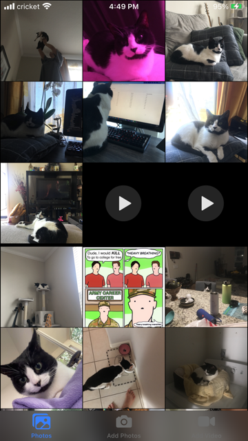
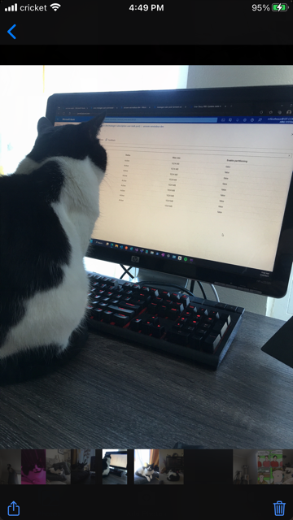

# MyPhoto
| Apple iOS Photos App semi-clone using (_React-Ionic-Capacitor_)

## *Sneek Peek*

## Features
- Default System UI imitation for native experience 
- Browse Photos and Videos
- Fullscreen slideshow with thumbreel
- Copy visual media from default app using native picker
- Persistent storage (SQLlite)
- Pinch and Drag Zoom
- native Share button

## Not Features (*...yet?*)
| _I did not need to include these features for myself so they have been left unimplemented and will continue as such until the end of time... maybe_

- Double tap to zoom
- Photo Metadata
- Custom Albums

### Notes
- media is public in your Files app